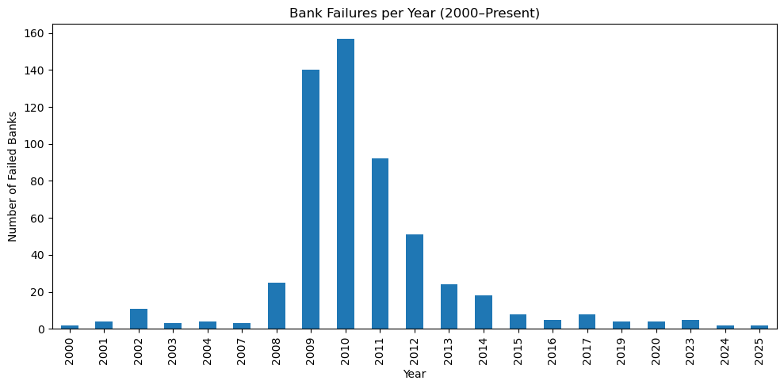
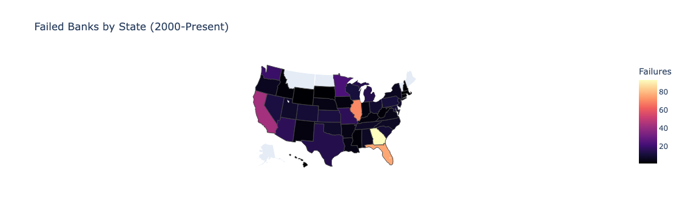
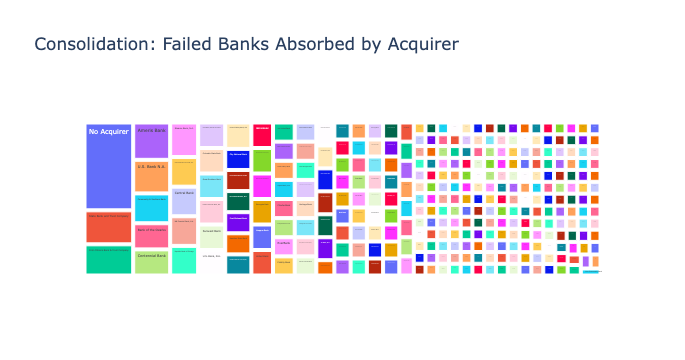
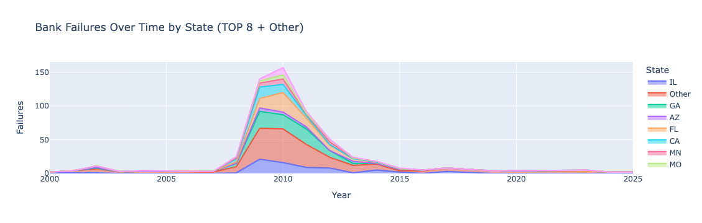

# Failed Bank Analysis (2000 - Present) 
_A business-valued focus analytical project usign FDIC failed bank data._

___
## Executive Summmary 
Between 2000 and 2025, There has been over **500 U.S. banks failed**, concentrated during the **2008-2012 financial crisis**. 

**Key Findings**
- Closures peaked during 2009 and 2010 with the total banks closed, peaking over 150 failures per year.
- Failures were concentrated in a 10 states, the main contendors being **Georgia, Florida, and Illinois**.
- Many large institutions absorbed failed banks, highlighting _Industry Consolidation_
- Since 2015, failures have been rare, emphasising the **post-crisis resilience**
___ 

 ## Background and Overview
 The purpose of this project is to analyze the FDIC's "Failed Bank List," inheriently covering all the U.S. bank closures since October 2000.

 The Goal: **extract actionable insight** for banks, regulators, and investors. 
 ## Background & Overview
This project analyzes the FDIC “Failed Bank List,” covering all U.S. bank closures since October 2000.  
The goal: **extract actionable insights** for regulators, banks, and investors.  

**Business questions addressed:**  
1. **When** did failures cluster most heavily?  
   → Failures spiked in 2009–2010, with more than 150 closures per year. 

2. **Where** were closures concentrated geographically?  
   → Failures were heavily concentrated in Southeastern and Midwestern states (e.g., Georgia, Florida, Illinois).  

3. **Who** absorbed failed banks, and how concentrated was that activity?  
   → A small set of repeat acquirers accounted for ~50% of resolutions. Consolidation was especially high during the 2009–2011 crisis.  

4. **How** did consolidation trends change over time?  
   → The Herfindahl–Hirschman Index (HHI) shows that acquirer concentration peaked during the financial crisis, then declined as failures became rare post-2015.  

5. **What signals** might help anticipate future risk?  
   → Geographic hotspots and repeat acquirer behavior suggest systemic vulnerabilities in community banking during downturns.

___

## Data Overview
**Columns**:
- 'bank_name'
- 'city'
- 'state'
- 'cert' (FDIC Certification Number)
- 'acquiring_institution'
- 'closing_date'
- 'fund'
___

## Visuals & Insights

### 1. Failures Over Time
  
- Closures peaked during the **2008–2010 crisis**, then normalized.

### 2. Geographic Hotspots
  
- Failures were concentrated in the **Southeast and Midwest**.

### 3. Consolidation Trends
  
- A few institutions absorbed most failures, showing **M&A dominance**.

### 4. State × Year Dynamics
  
- Certain states (e.g., Georgia, Florida) dominated during crisis years.
___

## Recommendations
- **Regulators:**  
  Focus supervision on historically high-risk states and smaller community banks.  
- **Banks:**  
  Maintain capital buffers and M&A strategies for downturn periods.  
- **Investors:**  
  Track regional exposure and acquirer activity as **M&A opportunities** during crises.

___
🔗 **Interactive Visuals**  
Static screenshots are shown below, but you can explore the full interactive Plotly charts in the notebook here:  
👉 [View on nbviewer](https://nbviewer.org/github/mdeep003/FailedBankAnalysis/blob/main/failed_banks_analysis.ipynb)
___

## How to Run
```bash
# Clone repo
git clone https://github.com/yourusername/failed-banks-analysis.git
cd failed-banks-analysis

# Create venv & install dependencies
make setup

# Launch notebook
make nb


